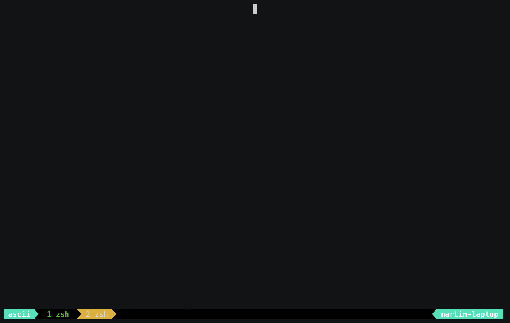

## Demo

### Migration

This demo shows a migration of a container that increments and prints an
integer every second. The instance on the left starts the container and the one
on the right joins the cluster. Eventually the left instance receives a
migration request and will migrate the container to the instance on the right.
Notice how after the migration the instance on the right keeps counting from
where the one on the left stopped.



## Documentation

- [Configuration](docs/configuration.md)
- [Example usages](docs/examples.md)
- [Benchmarking](docs/benchmarking.md)

## Running

### Example OCI-bundles

While the system should work with any OCI-bundle, how to generate some examples
that may be interesting are provided here.

Dependencies:

- [oci-runtime-tool](https://github.com/opencontainers/runtime-tools)
- [Docker](https://www.docker.com/)

#### Counter

This a minimal example of an OCI-bundle that runs a simple script
that increments an integer every second.

To generate the `rootfs`, any simple filesystem containing a shell should work.
Here, [busybox](https://hub.docker.com/_/busybox/) is used.

```shell
mkdir -p rootfs && docker export $(docker create busybox) | tar xvfC - rootfs
```

Next we need to copy the actual script to execute:

```shell
cp demos/runc/count.sh rootfs/
```

Generating `config.json`:

```shell
oci-runtime-tool generate \
	--args "sh" --args "/count.sh" \
	--linux-namespace-remove network > config.json
```

#### Redis

This example creates an OCI-bundle for a redis database.

```shell
mkdir -p rootfs && docker export $(docker create redis) | tar xvfC - rootfs
```

Generate `config.json`:

```shell
oci-runtime-tool generate \
	--args "redis-server" --args "--save ''" --args "--appendonly no" \
	--linux-namespace-remove network > config.json
```

The `--save ''` and `--appendonly no` options passed to the `--args` options
disables writing the redis database to disk, keeping everything in-memory, as
the system is not able to deal with persistent storage.

The database can populate with junk data for testing using the script
`scripts/redis/redis_populate.lua`, which generates `n` pairs of the form `i=i`
for every `0<=i<n`, where `n` is the first argument passed to script. The script
can be evaluated as follows:

```shell
redis-cli -h <host> --eval scripts/redis/redis_populate.lua <n>
```

### Docker

After creating a OCI-bundle a node can be run in docker in order to simulate
different hosts.
Building:

```shell
docker build -t msc -f docker/Dockerfile .
```

Docker sets the the cgroup filesystems in `/sys` to read-only. In order for runc
to mount these in the container, the `SYS_CAP_ADMIN` capability needs to be set,
which can be done via the `--privileged` flag to `docker run`.
Also the OCI-bundle's `rootfs` and `config.json` need to be passed to the
container as volumes using the `v` flag.

Running

```shell
docker run --name msc --privileged \
	-v $(pwd)/rootfs:/app/rootfs \
	-v $(pwd)/config.json:/app/config.json \
	msc <options>
```
